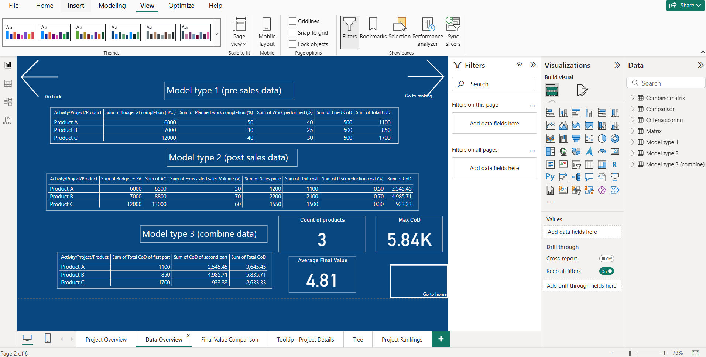
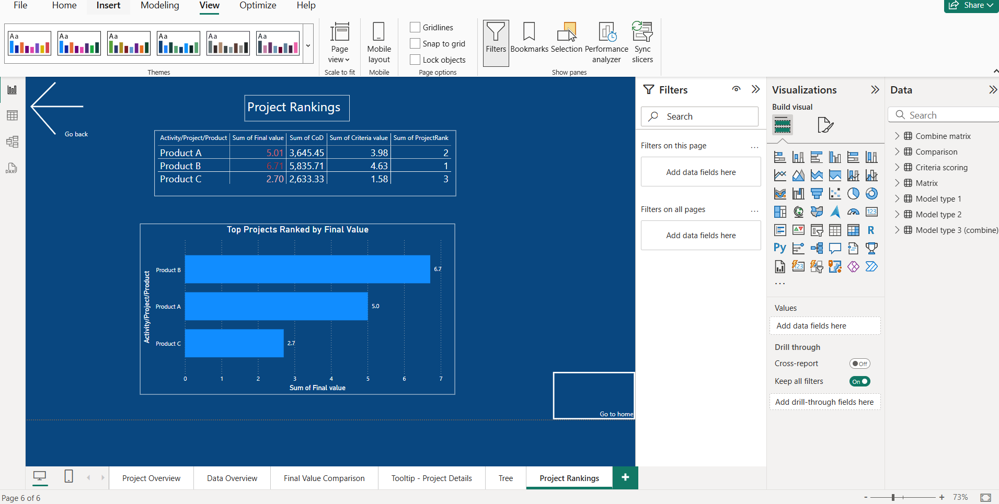

# Power BI - Cost of Delay (CoD) Prioritization Project

# Power BI - Cost of Delay (CoD) Prioritization Project

## 📘 Project Overview
This project analyzes and prioritizes product development projects based on Cost of Delay (CoD) methodology. 
It combines pre-sales and post-sales models with multiple decision-making criteria to guide strategic planning.

## 📊 What’s inside:
- Model 1: Pre-Sales Delay Costs
- Model 2: Sales-Phase Delay Costs
- Combined Cost Impact
- Weighted Criteria like Urgency, Strategic Alignment, Customer Value

## 🛠️ Tools Used
- Microsoft Power BI
- Microsoft Excel
- DAX (Data Analysis Expressions)

## 📂 Files Included
- `CoD_Prioritization_Dashboard.pbix` - Final Power BI dashboard
- `CoD_Model_Data.xlsx` - Raw data for models and criteria scoring
- `One Pager Summary.pdf` - Project background (optional)

## 📊 Dashboard Preview

### 📈 Final Value Comparison Chart

### 🪜 Final Value Decomposition Tree

## 🎯 Key Charts
### Project Rankings

## 🔥 Key Features
- Project final values comparison
- Priority rankings visualization
- Interactive tooltips and drill-through analysis
- Decomposition tree for delay cost analysis
- Page navigation for user-friendly flow

## 🚀 How to View
1. Download the `.pbix` file.
2. Open it using **Power BI Desktop** (free tool from Microsoft).

## 🙌 Acknowledgments
Thanks to the thesis guidance and CoD methodologies which formed the base for this project.
